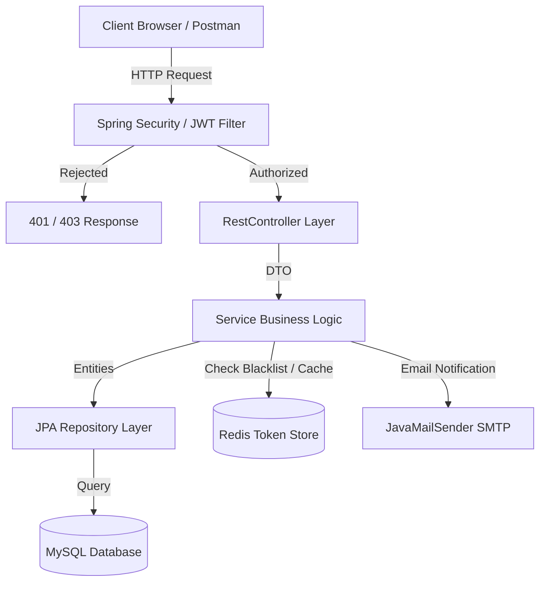
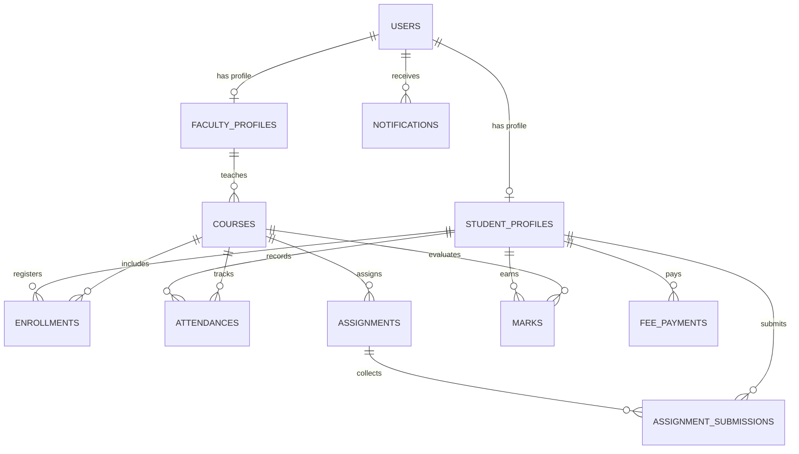
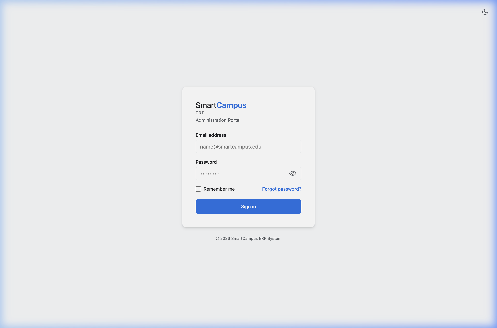
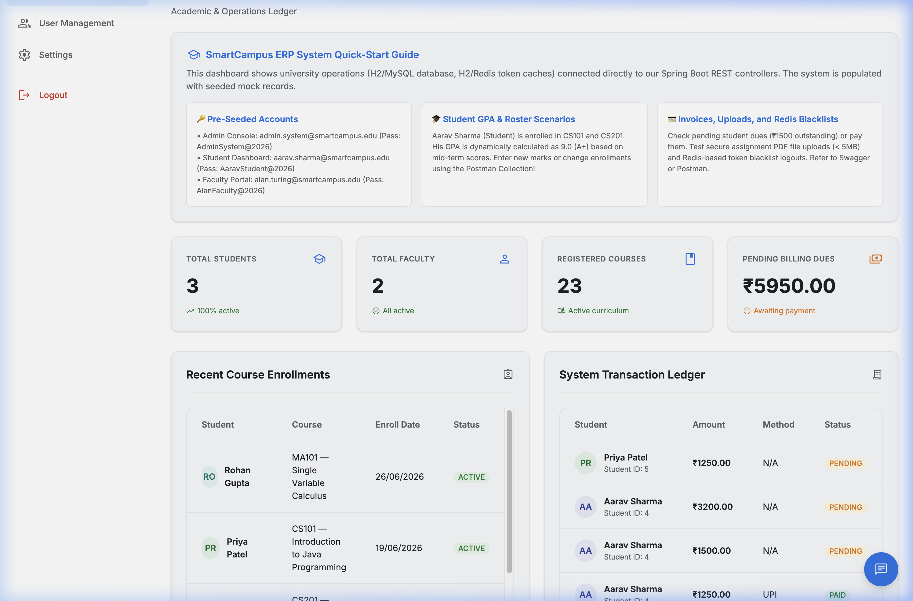
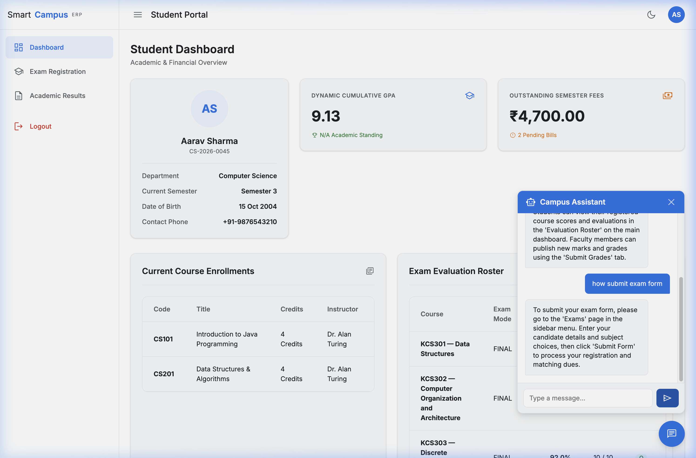

# SmartCampus ERP Backend
> A production-grade university management system backend, managing roles, academic evaluations, grading metrics, tuition billing, and alert engines.

[](https://oracle.com/java)
[](https://spring.io/projects/spring-boot)
[](https://mysql.com)
[](https://redis.io)
[](https://docker.com)

---

## Why This Project?
Rather than a basic CRUD application, this backend was built to showcase enterprise-level design patterns and tackle real-world complexity:
* **Stateless JWT Security + Redis Blacklisting**: Solves the standard "JWT stateless logout" challenge. When a user logs out, the token is extracted, its remaining time-to-live (TTL) is calculated, and it is stored in a Redis blacklist cache to prevent reuse.
* **Complex Business Logic (GPA Engine)**: Computes student GPAs dynamically using credit-hour-weighted letter grade points (O, A+, A, etc.) derived from course percentages, complete with floating-point rounding.
* **Role-Based Access Control (RBAC)**: Enforces strict separation of concerns across `STUDENT`, `FACULTY`, and `ADMIN` using declarative Method Security (`@PreAuthorize`).
* **Transactional integrity & Fail-safe Notification Dispatch**: Core operations (like course drops or bill settlements) are fully transactional. Notifications are logged to the database, with a fail-safe email dispatcher fallback that logs to the console if SMTP is offline.

---

## Technical Stack
| Category | Technology |
| --- | --- |
| **Core Platform** | Java 21, Spring Boot 3.3.5, Maven |
| **AI Integration** | Spring AI (1.0.0-M1), OpenAI (`gpt-4o-mini`), TokenTextSplitter |
| **Persistence** | MySQL 8.0, PostgreSQL (pgvector Store), Spring Data JPA, Hibernate, H2 (Local Default) |
| **Caching / Sessions**| Redis 7.2 |
| **Security** | Spring Security 6, Stateless JWT (JJWT 0.12.6), BCrypt |
| **APIs / Docs** | OpenAPI 3, Swagger UI, Postman |
| **Testing** | JUnit 5, Mockito, MockMvc |

---

## System Architecture



---

## Database Schema (Entity Relationships)



---

## Core Features & REST Endpoints
APIs are organized into clear Swagger tags:
* **Auth**: `/api/auth/register`, `/api/auth/login`, `/api/auth/logout`.
* **Student**: `/api/students/profile` (profile creation/update), `/api/students/courses`, `/api/students/attendance`, `/api/students/marks`, `/api/students/gpa` (dynamic GPA card), `/api/students/fees` (student balance dues).
* **Faculty**: `/api/faculties/profile`, `/api/faculties/attendance` (bulk submit class lists), `/api/faculties/marks` (enter gradebook records).
* **Enrollment**: `/api/enrollments/enroll` (student register course), `/api/enrollments/drop`, `/api/enrollments/courses/{courseId}` (roster lookup).
* **Assignment**: `/api/assignments` (create assignment), `/api/assignments/{id}/submit` (supports multipart solution files under 5MB), `/api/assignments/submissions/{id}/grade` (assign grade letter).
* **Fees**: `/api/fees/due` (issue bill to student), `/api/fees/{id}/pay` (mock visa/mastercard gateway processing).
* **Admin**: `/api/admin/users` (CRUD), `/api/admin/courses` (CRUD), `/api/admin/dashboard` (academic counts and billing totals), `/api/admin/enrollments` (all registrations list).
* **AI Advisor & Support**: `/api/support/chat` (resilient fluent AI assistant), `/api/support/advisor/advise` (RAG vector similarity advisor).
* **Exam Lifecycle**: `/api/exams/form/submit` (exam form matching ledger checks), `/api/exams/admit-card/download` (dynamic PDF Admit Card stream).
* **Payment Webhooks**: `/api/webhook/payment` (verifies Stripe/Razorpay payloads using HMAC-SHA256 headers).
* **Notifications**: `/api/notifications` (unread alerts list, mark read).

---

## How to Run

### Run Locally (Fallback/H2 Database)
This profile runs locally using an **in-memory H2 database** and an **in-memory JWT blacklist fallback**, requiring zero external installations.
1. Build the package:
   ```bash
   mvn clean install
   ```
2. Run the application:
   ```bash
   mvn spring-boot:run
   ```
* Swagger UI: [http://localhost:8080/swagger-ui.html](http://localhost:8080/swagger-ui.html)
* Admin Dashboard Panel: [http://localhost:8080/dashboard](http://localhost:8080/dashboard)

### Run via Docker Compose (Production Setup)
This launches the application container along with MySQL 8.0 and Redis containers:
```bash
docker compose up --build
```

---

## Interactive Admin Dashboard (No Frontend Tooling!)
We built an elegant, responsive single-page dashboard served at `/dashboard` displaying:
* Statistics counters (Total students, faculty, courses, and pending university billing).
* Real-time course enrollments stream.
* Transaction ledger showing paid and pending invoices.

> [!TIP]
> The dashboard uses a custom login card to authenticate using our JWT `/api/auth/login` endpoint. It saves the token in `localStorage`, passing it in AJAX requests.

---

## Postman Collection
We provided a pre-configured environment and request collection to speed up testing:
* **Collection JSON**: [SmartCampusERP.postman_collection.json](file:///Users/mansijpaliwal/Documents/smart%20campus%20erp/postman/SmartCampusERP.postman_collection.json)
* **Environment JSON**: [SmartCampusERP.postman_environment.json](file:///Users/mansijpaliwal/Documents/smart%20campus%20erp/postman/SmartCampusERP.postman_environment.json)

> [!NOTE]
> The `Register` and `Login` requests in this collection include a Postman test script that automatically extracts the JWT token from the response and updates the environment variable `jwtToken`. All subsequent requests authenticate automatically!

---

## Sample Credentials for Testing
First, register a user using `/api/auth/register`, or use the pre-filled dashboard credentials:
* **Admin User**: Email `admin@smartcampus.com`, Password `password123`
* **Student User**: Email `student@smartcampus.com` (Requires STUDENT registration)
* **Faculty User**: Email `faculty@smartcampus.com` (Requires FACULTY registration)

---

## Portfolio Screenshots

* **Portal Login Page**:
  
* **Interactive Glassmorphic Admin Dashboard**:
  
* **Student Portal & Integrated Campus Assistant Chatbot**:
  

---

## Portfolio Notes: Challenges Solved
* **Dynamic GPA Calculation**: Designed a custom calculation module using credit hour weights. Handled raw exam percentages to compute grades (O, A+, etc.) mapping to grade points, preventing double-evaluation and division-by-zero errors.
* **Stateless Secure Logouts**: Solved JWT stateless validation limits by designing a hybrid token checker. On logout, Lettuce Redis Client locks the JWT token with a TTL set to its exact duration remaining, preserving system speed while ensuring strict session invalidation.
* **Resilient File Handling**: Built a local file storage utility validating maximum uploads to 5MB, filtering MIME extension signatures, and separating paths for course assignment file distribution.
* **Granular AI Client Resiliency & Logging**: Integrated Spring AI's modern `ChatClient` builder. Engineered robust error boundary mappings catching `TransientAiException` and `NonTransientAiException` (like 429 quota errors) while maintaining a clean user experience via smart operational fallbacks and tracing errors via SLF4J log lines.
* **Double-Entry Ledger Integrity Hash Chain**: Structured an auditable double-entry transaction database log using SHA-256 integrity hash chains (linking each transaction to the previous block's hash) verified within serializable isolation boundaries to guarantee transaction ledger immutability.
