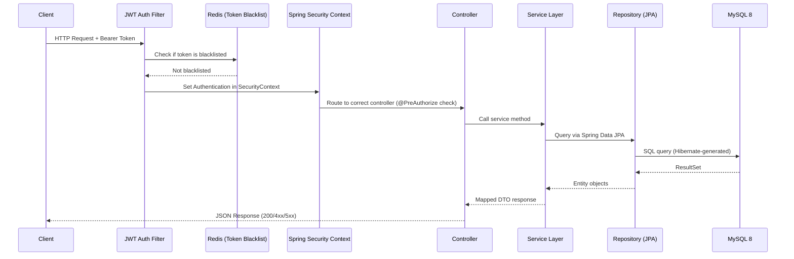
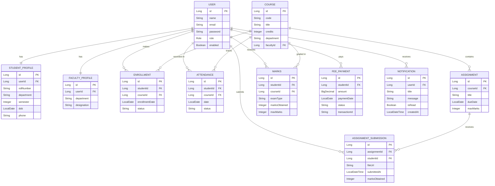
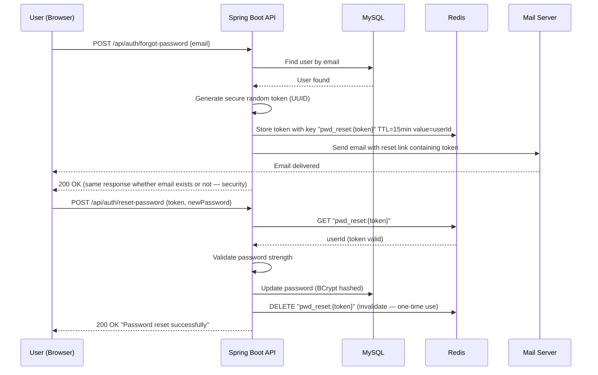

# SmartCampus ERP — Technical Deep Dive

---

## 1. Project Overview

The SmartCampus ERP system is a centralized administration platform managing multi-role academic and operations data. The core technical challenge lies in enforcing granular, role-based access control (RBAC) over interconnected domains including enrollments, grades, attendance records, and student billing ledgers. To address this, I designed a stateless architecture secured by JSON Web Tokens (JWT) coupled with a Redis-backed token blacklist and reset token caching system. Data integrity is maintained at the database level using MySQL 8 transactional constraints, JPA relationship definitions, and strict input validation. The entire ecosystem (Spring Boot app, MySQL database, and Redis cache instance) is containerized and deployed seamlessly using Docker Compose.

---

## 2. System Architecture

I implemented a classic layered architecture separating request interception, orchestration, business logic execution, and database persistence. This decoupling isolates concerns, eases automated testing with unit mocks, and isolates changes within single layer bounds.



The system request lifecycle operates across four primary bounds:
- **Filters/Interceptors**: Intercept inbound HTTP traffic, validate token signatures, check blacklists against memory stores, and bind identity metadata to the Security Context.
- **Controllers**: Define the exposed REST contract, enforce method-level role authorization criteria, perform request payload constraint validation, and map input variables to operations.
- **Service Layer**: Execute the core transactional business logic, coordinate multiple repository operations, calculate aggregate data metrics (e.g. GPA calculations), and enforce state rules.
- **Data Access Layer**: Abstract SQL executions via JPA repositories and Spring Data abstractions, matching physical relational schema profiles.

---

## 3. Database Design & Entity Relationships

The schema is composed of 11 distinct entities representing core identity definitions (`User`, `StudentProfile`, `FacultyProfile`), operational metrics (`Course`, `Enrollment`, `Attendance`), academic materials (`Assignment`, `AssignmentSubmission`, `Marks`), and operations logs (`FeePayment`, `Notification`). The decision to configure `FetchType.LAZY` globally across all relationships prevents Hibernate from triggering the `N+1` select problem during query execution, keeping queries controlled and explicit. Cascade actions (`CascadeType.ALL`) are only declared on direct, tightly coupled child components (e.g. `User` owning its profile definitions) to prevent orphaned entity graphs. To preserve data history, I avoided hard deletes on critical resources (e.g. user records) and implemented a soft delete strategy using an `enabled` state flag.



---

## 4. Security Architecture

### 4.1 JWT Implementation
I integrated the Java JWT library (`jjwt` version `0.12.x`) for lightweight token signatures without adding the heavy dependency of an external OAuth2 authentication server. The generated tokens embed target claims containing the user identifier (`userId`), primary security email (`email`), and system credentials role (`role`). The token expiry is set to 24 hours to balance session longevity and security. The token is cryptographically signed using the `HS256` HMAC-SHA algorithm, utilizing a 256-bit secret key injected from the runtime host environment. Token decoding and user context population are handled in `JwtAuthFilter` (extending `OncePerRequestFilter`), guaranteeing that token validation is executed exactly once per inbound HTTP request.

### 4.2 Redis Token Blacklisting
To support stateful logout operations in a stateless JWT environment, I introduced a Redis-backed token blacklisting strategy. When a user requests a logout, the token's signature identifier (JTI) is stored in Redis, with its Time-to-Live (TTL) set to the remaining expiration window of the token itself. Each inbound request query checks Redis during the security filter chain execution; if a match is found in the blacklist cache, the filter halts execution and returns a `401 Unauthorized` status. Redis is chosen over relational database tables because it supports `O(1)` memory lookups and handles automatically expiring records without needing scheduled table cleanup scripts. If the connection to Redis fails, the system logs a fallback warning and fails open, ensuring server uptime for existing users while maintaining strict authorization checks at the database query boundary.

### 4.3 Role-Based Access Control
The application supports three roles: `ADMIN`, `FACULTY`, and `STUDENT`. I implemented authorization checks using method-level `@PreAuthorize` annotations on the REST controllers rather than global URL patterns. This ensures that security declarations remain co-located with the corresponding execution code and survive endpoint path refactorings.

```java
  // Only admins can create users
  @PreAuthorize("hasRole('ADMIN')")
  public ResponseEntity<UserResponse> createUser(...)

  // Faculty and admins can mark attendance
  @PreAuthorize("hasAnyRole('FACULTY', 'ADMIN')")
  public ResponseEntity<Void> markAttendance(...)

  // Students can only view their own marks
  @PreAuthorize("hasRole('STUDENT') and #studentId == authentication.principal.id")
  public ResponseEntity<List<MarksResponse>> getMyMarks(...)
```

### 4.4 Input Validation Strategy
Incoming request objects are validated against structural invariants using the Jakarta Bean Validation API (`hibernate-validator`). Validation is triggered before controller logic runs using the `@Valid` annotation. The `GlobalExceptionHandler` intercepts any `MethodArgumentNotValidException` and structures it into a field-level error report:

```json
  {
    "timestamp": "2026-06-21T10:30:00",
    "status": 422,
    "error": "Validation Failed",
    "errors": {
      "email": "Must be a valid email address",
      "password": "Must be at least 8 characters"
    },
    "path": "/api/admin/users"
  }
```

I chose HTTP status `422 Unprocessable Entity` over `400 Bad Request` for validation failures because the request payload is syntactically well-formed, but fails semantic domain rules.

---

## 5. GPA Calculation Engine

### 5.1 Formula & Scale
The academic grading engine computes Course Grade Points using the following formula:
$$\text{Grade Points per Course} = \frac{\text{marksObtained}}{\text{maxMarks}} \times 10$$

Letter grades are assigned based on a standard 10-point scale:
- $9.0 - 10.0 \rightarrow \text{O (Outstanding)}$
- $8.0 - 8.9 \rightarrow \text{A+ (Excellent)}$
- $7.0 - 7.9 \rightarrow \text{A (Very Good)}$
- $6.0 - 6.9 \rightarrow \text{B+ (Good)}$
- $5.5 - 5.9 \rightarrow \text{B (Above Average)}$
- $5.0 - 5.4 \rightarrow \text{C (Average)}$
- $\text{Below } 5.0 \rightarrow \text{F (Fail)}$

$$\text{CGPA} = \frac{\sum (\text{gradePoints} \times \text{creditHours})}{\sum \text{creditHours}}$$

This 10-point scale was selected to match the grading conventions of major Indian universities.

### 5.2 Implementation Notes
The `GpaCalculationServiceImpl` fetches all active course enrollments, aggregates marks per course from the marks book, maps grades to weight metrics, and returns the calculated CGPA. Courses without recorded grades are excluded from both the numerator and the denominator of the CGPA calculation to prevent penalizing students for ungraded courses.

```json
  {
    "cgpa": 8.43,
    "totalCredits": 24,
    "letterGrade": "A",
    "courseBreakdown": [
      {
        "courseCode": "CS301",
        "courseTitle": "Data Structures",
        "credits": 4,
        "marksObtained": 87,
        "maxMarks": 100,
        "gradePoints": 8.7,
        "letterGrade": "A+"
      }
    ]
  }
```

---

## 6. Forgot Password Flow

The forgot password recovery workflow utilizes secure email validation links backed by Redis storage.



- **User Enumeration Prevention**: The `/forgot-password` endpoint returns a generic success response regardless of whether the email address exists in the database. This prevents attackers from profiling register databases.
- **Redis Cache Storage**: The reset tokens are stored in Redis using a `pwd_reset:{token}` schema with a 15-minute TTL. This avoids database overhead for temporary access states.
- **Single-Use Tokens**: The recovery token is deleted immediately upon successful validation, preventing replay attacks.
- **BCrypt Encryption**: Passwords are saved as one-way BCrypt hashes using a work factor of 10.

---

## 7. API Design Decisions

1. **DTOs over Entity exposure**
   Database entities are never serialized directly in API responses. I enforce mapping to distinct Request/Response Data Transfer Objects (DTOs) for all endpoints. This decouples the public contract from the physical schema and prevents accidental sensitive data exposure (e.g. password fields).
2. **Consistent error response format**
   Every exception is mapped to a unified JSON error payload structure by the global exception handler, allowing clients to handle all errors consistently.
3. **Pagination on all list endpoints**
   To prevent memory issues and optimize response times, all collection endpoints require paginated parameters (`Pageable`) and default page/size constraints.
4. **Soft delete over hard delete**
   User accounts are soft-deleted by setting the `enabled` attribute to `false` instead of dropping rows. This maintains referential integrity across the historical attendance, enrollment, and grade records.
5. **Idempotent enrollment**
   Re-submitting course enrollment requests for an already registered course returns a `200 OK` rather than throwing a duplicate conflict exception. This allows safe retries.
6. **Transactional fee recording**
   Billing and invoice transactions are executed inside `@Transactional` blocks, guaranteeing that partial payment records are never written if payment processing or transaction ID generation fails.
7. **Email failure isolation**
   Email dispatch methods are declared `@Async`. If SMTP servers time out or fail, the exception is caught and logged, but the main client request still completes successfully.

---

## 8. Infrastructure & DevOps

### Docker Compose Setup
The container network sets up three services in order:
- `mysql`: Launches a MySQL 8 database, persists tables to a named Docker volume, and exposes an internal health check using `mysqladmin ping`.
- `redis`: Launches a lightweight Redis Alpine container used for transient token and session caching.
- `app`: Builds and hosts the Spring Boot JAR, configured to start only after the database service is healthy.

```yaml
healthcheck:
  test: ["CMD", "mysqladmin", "ping", "-h", "localhost"]
  interval: 10s
  timeout: 5s
  retries: 5
```

This prevents database connection exceptions that occur when the application container starts before MySQL has finished initializing.

### Multi-Stage Dockerfile
To minimize production images, the application uses a two-stage build:
- **Build Stage**: Compiles and packages the application using the Eclipse Temurin JDK 21 and Maven.
- **Runtime Stage**: Copies the generated JAR file into a slim alpine runtime environment. This reduces the image footprint from ~600MB to ~200MB.

### Environment Variables
The application reads its core configurations from the following environment variables:
- `DB_URL`: The MySQL JDBC URL.
- `DB_USERNAME`: The MySQL database connection username.
- `DB_PASSWORD`: The MySQL database connection password.
- `JWT_SECRET`: The Base64 encoded HS256 JWT signature key.
- `REDIS_HOST`: The Redis cache host address.
- `REDIS_PORT`: The Redis cache port (default `6379`).
- `MAIL_HOST`: The SMTP server host address.
- `MAIL_PORT`: The SMTP server connection port.
- `MAIL_USERNAME`: The SMTP server username.
- `MAIL_PASSWORD`: The SMTP server password.

---

## 9. Testing Strategy

### Unit Tests
*   Every service class has a corresponding test suite using Mockito to mock repository layers.
*   These tests verify core business logic in isolation, without boot startup overhead.
*   For example, `GpaCalculationServiceTest` validates grade calculations, checks boundary conditions for letter grades, and ensures ungraded courses do not affect the CGPA.

### Integration Tests
*   Executed with `@SpringBootTest` using an in-memory H2 database (`application-test.yml`).
*   Uses MockMvc to test REST controller endpoints, verifying authentication rules, role restrictions, and HTTP response codes.
*   For example, `AuthControllerIntegrationTest` verifies the full user registration, login, token authentication, and token blacklisting flows.

### What is NOT tested and why
*   **Repository Interfaces**: Spring Data JPA repositories are framework interfaces. We do not write tests for them since testing framework implementations is redundant.
*   **Hibernate Entity Mapping**: Mapping configurations are verified by Hibernate's automated schema generation on boot.

---

## 10. Known Limitations & Future Improvements

**Current Limitations:**
- **Refresh Token Pattern**: Lacks a refresh token flow; users must re-authenticate once their 24-hour token expires.
- **Local Storage Dependency**: Uploaded files are saved to local storage, which prevents horizontal scaling.
- **Async Message Queue**: Ephemeral asynchronous execution is used; this should be replaced with a reliable message broker like RabbitMQ or Kafka in production.
- **Auth Rate Limiting**: The authorization endpoints are vulnerable to brute-force attacks due to the lack of rate limiting.

**Planned Improvements:**
- Implement a sliding session pattern using Redis to store refresh tokens.
- Integrate AWS S3 or MinIO for stateless, scalable file storage.
- Introduce Apache Kafka to handle enrollment notifications asynchronously.
- Add Spring Boot Actuator coupled with Micrometer and Prometheus to monitor metrics.
- Enforce API rate-limiting using Spring Cloud Gateway or Bucket4j.

---

## 11. How to Run

### One-command startup (recommended)
```bash
docker compose up --build
```
Services start in order: MySQL $\rightarrow$ Redis $\rightarrow$ Spring Boot App.
- Application URL: `http://localhost:8080`
- Swagger Documentation: `http://localhost:8080/swagger-ui.html`

### Run locally (requires local MySQL and Redis)
```bash
export DB_URL=jdbc:mysql://localhost:3306/smartcampus
export DB_USERNAME=root
export DB_PASSWORD=yourpassword
export JWT_SECRET=your-256-bit-base64-secret
export REDIS_HOST=localhost

mvn spring-boot:run -Dspring-boot.run.profiles=dev
```

### Run tests
```bash
mvn test
# Run a specific test suite:
mvn test -Dtest=GpaCalculationServiceTest
```

---

## 12. API Quick Reference

| Method | Endpoint | Role Required | Description |
| :--- | :--- | :--- | :--- |
| **POST** | `/api/auth/register` | Permit All | Register a new user account |
| **POST** | `/api/auth/login` | Permit All | Authenticate credentials and get a JWT token |
| **POST** | `/api/auth/logout` | Permit All | Invalidate a token using the Redis blacklist |
| **POST** | `/api/auth/forgot-password` | Permit All | Trigger a password reset email |
| **POST** | `/api/auth/reset-password` | Permit All | Reset a password using a valid token |
| **GET** | `/api/students/profile` | `STUDENT` | Retrieve the authenticated student's profile |
| **GET** | `/api/students/courses` | `STUDENT` | List enrolled courses for the student |
| **GET** | `/api/students/marks` | `STUDENT` | Get the student's marks and evaluation grades |
| **GET** | `/api/students/gpa` | `STUDENT` | Retrieve the calculated CGPA and academic standing |
| **GET** | `/api/students/fees` | `STUDENT` | View outstanding fees and payment history |
| **GET** | `/api/faculties/profile` | `FACULTY` | Retrieve the authenticated faculty's profile |
| **GET** | `/api/faculties/courses` | `FACULTY` | Get courses assigned to the faculty member |
| **POST** | `/api/faculties/attendance` | `FACULTY` | Record student attendance |
| **POST** | `/api/faculties/marks` | `FACULTY` | Submit student grades |
| **POST** | `/api/admin/users` | `ADMIN` | Create a new user account |
| **GET** | `/api/admin/users` | `ADMIN` | Search and filter all user accounts |
| **DELETE** | `/api/admin/users/{id}` | `ADMIN` | Soft-delete a user account |
| **GET** | `/api/admin/dashboard` | `ADMIN` | Retrieve system operational metrics |
| **POST** | `/api/fees/{id}/pay` | `STUDENT` | Process a mock payment transaction |
| **POST** | `/api/assignments/upload` | `STUDENT` | Upload a PDF assignment file |

> Full interactive documentation is available at `/swagger-ui.html` when the application is running. All endpoints include request/response schemas and can be tested directly from the browser.
